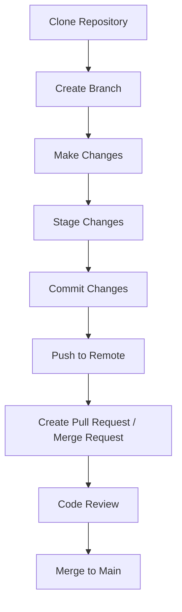

# 📘 Version Control System (VCS) 

| Author         | Created on     | Version         | Last updated by | Last edited on | Pre Reviewer | L0 Reviewer | L1 Reviewer | L2 Reviewer |
|----------------|----------------|-----------------|-----------------|----------------|---------------|-------------|-------------|-------------|
| Mohamed Tharik | 2025-04-17     |     Version 1         | Mohamed Tharik  | 2025-04-17     |Priyanshu | Khushi | Mukul Joshi|Piyush Upadhyay |

## 📌 What is a Version Control System?

A **Version Control System (VCS)** is a tool that helps developers manage and track changes to source code over time. It allows multiple people to work on the same codebase, keeps a history of changes, and facilitates collaboration and code recovery.

---

## 🎯 Why Use a Version Control System?

- Track changes and history
- Collaborate across teams
- Revert to previous versions
- Branch and experiment without affecting production
- Increase code quality and reliability
- Backup source code securely

---

## 🧰 Types of Version Control Systems

### 1. **Local VCS**
- Stores versions on a local machine
- Example: RCS (Revision Control System)

### 2. **Centralized VCS (CVCS)**
- Single central server stores all versions
- Developers check out and commit to this server
- Examples: CVS, Subversion (SVN), Perforce

### 3. **Distributed VCS (DVCS)**
- Every developer has a full copy of the repository
- Enables offline commits and full version history locally
- Examples: Git, Mercurial, Bazaar

---

## ✅ Advantages of VCS

- Easy rollback and history tracking
- Supports team collaboration
- Branching and merging support
- Backup and disaster recovery
- Detailed changelogs and auditing

---

## ❌ Disadvantages of VCS

- Learning curve for new users
- Merge conflicts can be complex
- Large binary files may bloat repositories
- DVCS requires more local disk space

---

## 🔄 VCS Workflow (Git-based)

## 🛠️ Best Practices for Version Control

- **Use meaningful commit messages**  
  Clearly describe what the commit does and why the change was made.

- **Commit often, but logically grouped**  
  Commit related changes together instead of bundling everything into one.

- **Create branches for features/fixes**  
  Isolate work in branches to keep the main branch stable.

- **Keep branches updated with main**  
  Regularly merge or rebase from the main branch to avoid large conflicts.

- **Avoid committing sensitive files**  
  Do not include API keys, passwords, or confidential data in the repo.

- **Use `.gitignore` to exclude unnecessary files**  
  Prevent clutter by excluding build files, logs, temporary files, etc.

- **Tag releases and stable versions**  
  Use Git tags to mark milestones and production-ready versions.

- **Regularly backup remote repositories**  
  Push changes frequently to avoid local data loss.

---

## 📍 Conclusion

Version Control Systems are essential tools in modern software development. Whether working solo or in a team, using a VCS helps:

- Manage code efficiently  
- Collaborate effectively  
- Maintain a clean and traceable project history  

Mastering VCS is a crucial skill for developers, enabling better teamwork, faster development cycles, and safer code changes.

