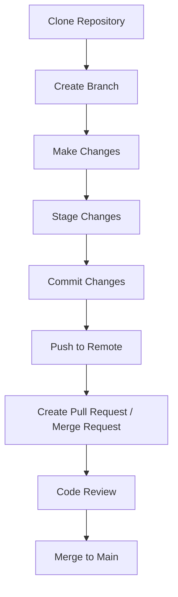

# 📘 Version Control System (VCS) 

| Author         | Created on     | Version         | Last updated by | Last edited on | Pre Reviewer | L0 Reviewer | L1 Reviewer | L2 Reviewer |
|----------------|----------------|-----------------|-----------------|----------------|---------------|-------------|-------------|-------------|
| Mohamed Tharik | 2025-04-17     |     Version 1         | Mohamed Tharik  | 2025-04-17     |Priyanshu | Khushi | Mukul Joshi|Piyush Upadhyay |

---

## 🎯 Purpose

The purpose of this document is to provide a comprehensive understanding of **Version Control Systems (VCS)**, their importance in modern software development, and best practices for using them effectively. This document aims to help developers, DevOps engineers, and teams:

- Understand what a VCS is and why it's essential
- Learn about different types of VCS
- Explore the advantages and disadvantages
- Follow standard workflows and industry best practices
- Improve collaboration and code management

---
## 📑 Table of Contents

- [📌 What is a Version Control System?](#-what-is-a-version-control-system)
- [🎯 Why Use a Version Control System?](#-why-use-a-version-control-system)
- [🧰 Types of Version Control Systems](#-types-of-version-control-systems)
  - [1. Local Version Control System (LVCS)](#1-local-version-control-system-lvcs)
  - [2. Centralized VCS (CVCS)](#2-centralized-vcs-cvcs)
  - [3. Distributed VCS (DVCS)](#3-distributed-vcs-dvcs)
- [✅ Advantages of VCS](#-advantages-of-vcs)
- [❌ Disadvantages of VCS](#-disadvantages-of-vcs)
- [🔄 VCS Workflow (Git-based)](#-vcs-workflow-git-based)
- [🛠️ Best Practices for Version Control](#️-best-practices-for-version-control)
- [📍 Conclusion](#-conclusion)
- [📬 Contact Information](#-contact-information)
- [📚 Reference](#-reference)
---

## 📌 What is a Version Control System?

A **Version Control System (VCS)** is a tool that helps developers manage and track changes to source code over time. It allows multiple people to work on the same codebase, keeps a history of changes, and facilitates collaboration and code recovery.

---

## 🎯 Why Use a Version Control System?

- Track changes and history
- Collaborate across teams
- Revert to previous versions
- Branch and experiment without affecting production
- Increase code quality and reliability
- Backup source code securely

---

## 🧰 Types of Version Control Systems

Version Control Systems can be categorized into three main types based on how they manage data and collaboration:

### 1. **Local Version Control System (LVCS)**

A Local VCS keeps track of file changes within the same computer. These systems are simple and primarily useful for individual developers.

- ✅ Pros:
  - Easy to set up and use
  - No internet or network dependency
- ❌ Cons:
  - Not suitable for team collaboration
  - Higher risk of data loss if the local machine fails

**🔧 Example:**  
- **RCS (Revision Control System):** Stores changes as a set of diff files on disk. One of the earliest VCS tools.

---

### 2. **Centralized Version Control System (CVCS)**

A Centralized VCS has a single central server that stores all the versioned files. Developers pull (check out) the latest version from the server and commit changes back to it.

- ✅ Pros:
  - Easy to manage in a team environment
  - Centralized backup and administration
- ❌ Cons:
  - Requires constant internet/server access
  - A server crash may result in loss of the entire codebase if not backed up

**🌐 Examples:**  
- **CVS (Concurrent Versions System)**  
- **SVN (Apache Subversion)**  
- **Perforce**

---

### 3. **Distributed Version Control System (DVCS)**

In a Distributed VCS, every developer has a complete copy (clone) of the entire repository including its full history. Changes are made locally and pushed to a shared remote repository when ready.

- ✅ Pros:
  - Offline work possible
  - Faster operations due to local repository
  - Improved collaboration with branching and merging
- ❌ Cons:
  - Slightly higher learning curve
  - More local storage required for full repository clones

**🚀 Examples:**  
- **Git** (most popular, used by GitHub, GitLab, Bitbucket)  
- **Mercurial**  
- **Bazaar**

---

## ✅ Advantages of VCS

- Easy rollback and history tracking
- Supports team collaboration
- Branching and merging support
- Backup and disaster recovery
- Detailed changelogs and auditing

---

## ❌ Disadvantages of VCS

- Learning curve for new users
- Merge conflicts can be complex
- Large binary files may bloat repositories
- DVCS requires more local disk space

---

## 🔄 VCS Workflow (Git-based)

## 🛠️ Best Practices for Version Control

- **Use meaningful commit messages**  
  Clearly describe what the commit does and why the change was made.

- **Commit often, but logically grouped**  
  Commit related changes together instead of bundling everything into one.

- **Create branches for features/fixes**  
  Isolate work in branches to keep the main branch stable.

- **Keep branches updated with main**  
  Regularly merge or rebase from the main branch to avoid large conflicts.

- **Avoid committing sensitive files**  
  Do not include API keys, passwords, or confidential data in the repo.

- **Use `.gitignore` to exclude unnecessary files**  
  Prevent clutter by excluding build files, logs, temporary files, etc.

- **Tag releases and stable versions**  
  Use Git tags to mark milestones and production-ready versions.

- **Regularly backup remote repositories**  
  Push changes frequently to avoid local data loss.

---

## 📍 Conclusion

Version Control Systems are essential tools in modern software development. Whether working solo or in a team, using a VCS helps:

- Manage code efficiently  
- Collaborate effectively  
- Maintain a clean and traceable project history  

Mastering VCS is a crucial skill for developers, enabling better teamwork, faster development cycles, and safer code changes.

## 📬 Contact Information

| Name | Email address         |
|------|------------------------|
| Mohamed Tharik  | md.tharik.sanaatak@mygurukulam.co    |

## 📚 Reference

| Links                                                                                                                                                                                                                     | Descriptions                                                                                         |

